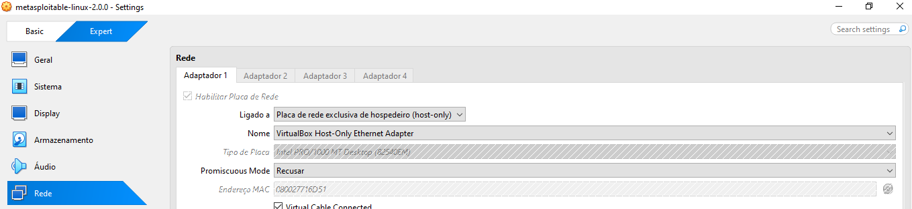
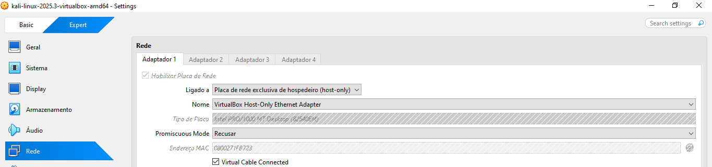
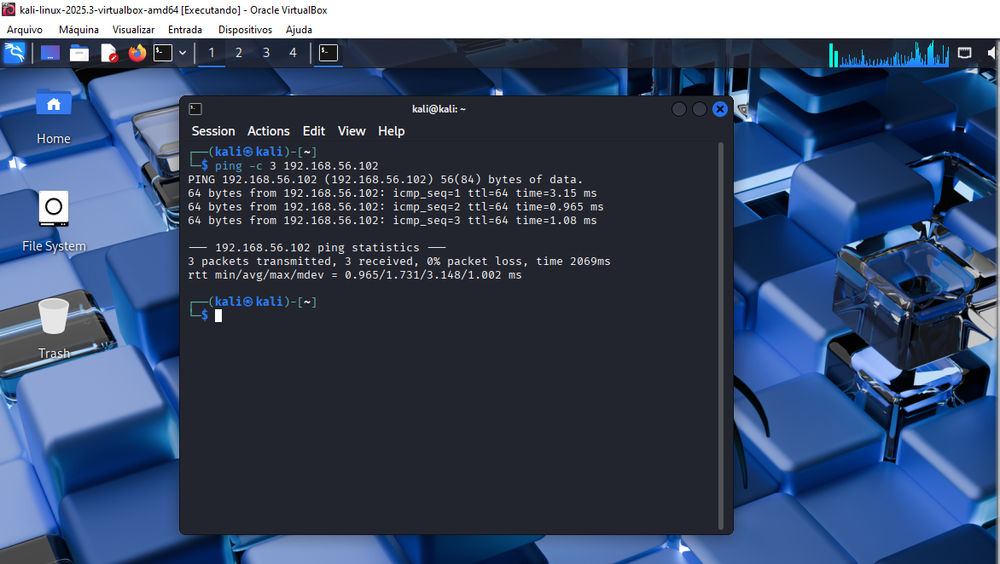
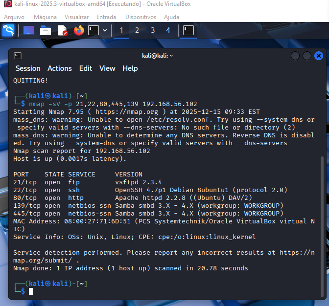
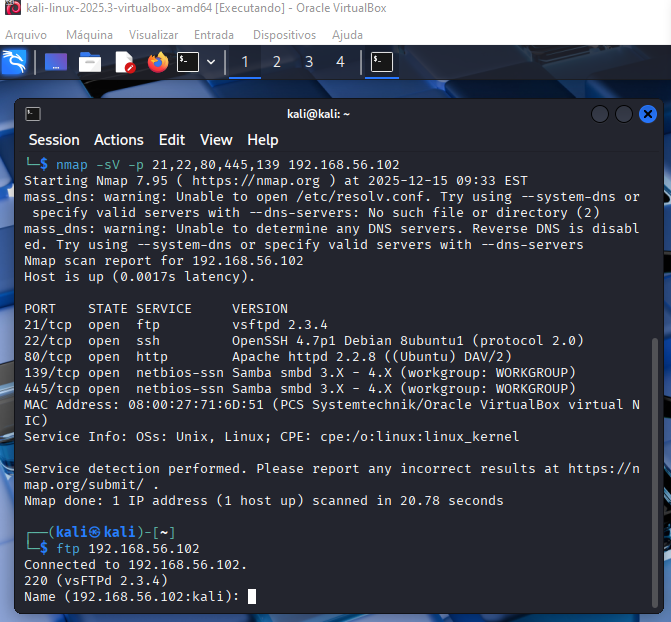
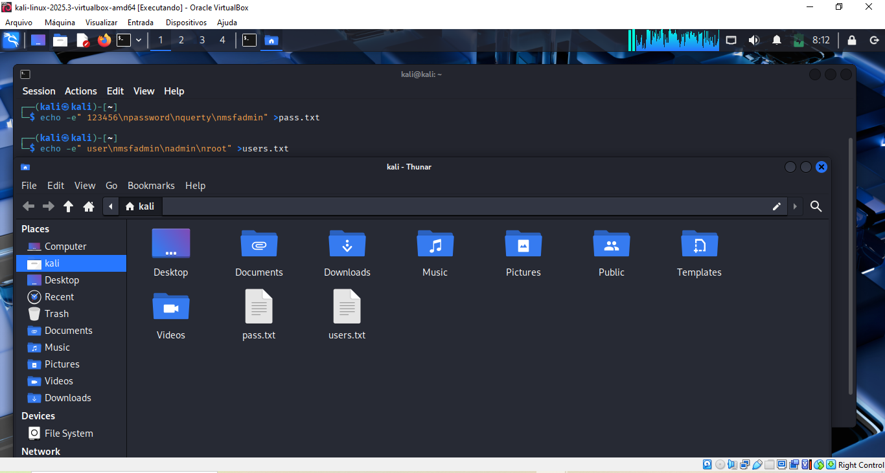
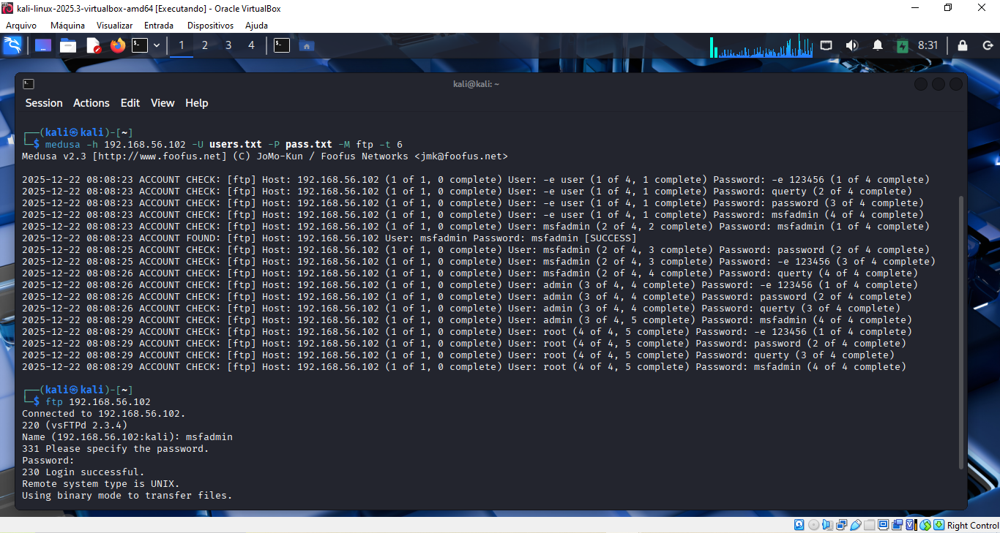

# 📘 Desafio DIO: Simulando um Ataque de Brute Force de Senhas com Medusa e Kali Linux
## 📝 Descrição do desafio
Este desafio da DIO tem como objetivo simular um ataque de força bruta em um ambiente controlado com VMs, explorando serviços vulneráveis (FTP, DVWA e SMB). A execução utiliza o Kali Linux e a ferramenta Medusa, com a finalidade de propor e praticar medidas de prevenção.
## ⚙️ Configuração do Ambiente
| Software | Versão | Link |
|----------|------|------|
| Kali Linux | 2025.3  | https://www.kali.org/get-kali/#kali-virtual-machines |
| Metasploitable | 2.0.0 | https://sourceforge.net/projects/metasploitable/files/Metasploitable2/ |
| Oracle VirtualBox  | 7.2.4  | https://www.virtualbox.org/wiki/Downloads |
### Rede
1. VirtualBox Host-Only Metasploitable

2. VirtualBox Host-Only Kali Linux

### Validação
#### Teste de Conectividade 
ping -c 

## 🔐 Cenários de Ataque
### Força Bruta em FTP
#### 1. Varredura de portas vulneráveis e versão dos serviços 
nmpa -sV -p 

#### 2. Teste de conectividade
ftp 

#### 3. Criação de usuários e senhas
echo -e

#### 4. Força bruta em FTP
medusa -h

## 🛡️ Recomendações de Mitigação
De uma forma geral, podemos aplicar políticas de bloqueio após tentativas falhas, além de monitoramento ativo de acessos e treinamento de usuários. Para os ataques específicos, podemos aplicar as ações abaixo:
#### FTP: Desabilitar login anônimo, usar senhas fortes e habilitar TLS;
#### Web (DVWA): Implementar CAPTCHA, limitar tentativas de login e usar MFA;
#### SMB: Restringir compartilhamentos, aplicar políticas de senha e monitorar logs.
